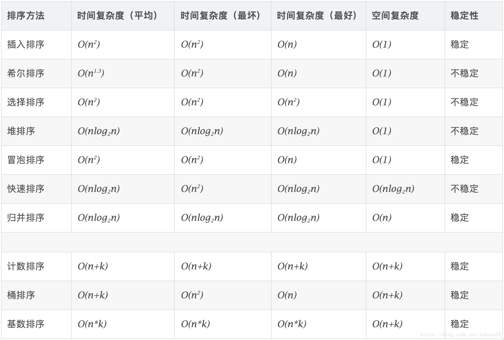

## 概念解释:

稳定：如果a原本在b前面，而a=b，排序之后a仍然在b的前面。
不稳定：如果a原本在b的前面，而a=b，排序之后 a 可能会出现在 b 的后面。
时间复杂度：对排序数据的总的操作次数。反映当n变化时，操作次数呈现什么规律。
空间复杂度：是指算法在计算机内执行时所需存储空间的度量，它也是数据规模n的函数。


## 1、插入排序

​		思路:将待排序元素从后往前依次与已排序的部分进行比较，直到大于cur大于nums[j]后插入cur。

​		时间复杂度：最佳o(n),最差o(n^2),平均o(n^2) ,空间复杂度O(1) **稳定算法**

```cpp
void InsertSort(vector<int> &nums){
    for(int i=1;i<nums.size();++i){
        int cur=nums[i];
        int j=i-1;
        while(j>=0&&cur<nums[j]){
            nums[j+1]=nums[j];
            j--;
        }
        nums[j+1]=cur;
    }
}
```

算法分析：采用in-place排序，只需要用到O(1)的额外空间；因而在从后向前扫描过程中，需要反复把已经排序的元素逐步向后挪位，为新元素提供插入空间。

## 2、选择排序

​	思路：每次遍历选择出未排序列中的最小的元素，放到已经排序的序列的起始位置。

​	复杂度:平均（O(n^2),最差（O(n^2),最好（O(n^2),空间复杂度O(1),**不稳定算法**

```CPP
void SelectSort(vector<int> &nums){
    for(int i=0;i<nums.size();++i){
        int min_idx=i;
        for(int j=i+1;j<nums.size();++j){
            if(nums[j]<nums[min_idx]){
                min_idx=j;
            }
        }
        swap(nums[i],nums[min_idx]);
    }
}
```

选择排序是表现最稳定的排序之一，因为无论什么数据进去都是O(n^2)的复杂度，所以使用的适合数据规模越小越好。

## 3、冒泡排序

两两比较，共比较n趟，复杂度O(n^2),空间复杂O(1),**稳定算法**

```cpp
void BubbleSort(vector<int>& nums) {
	for (int i = 0; i < nums.size()-1; ++i) {
		for (int j = 0; j < nums.size() - i-1; ++j) {
			if (nums[j] > nums[j+1]) {
				swap(nums[j], nums[j + 1]);
			}
		}
	}
}
```

## 4、快速排序

时间复杂度平均O(nlogn),最差O(n^2),最好O(nlogn),空间复杂度O(nlogn),**不稳定算法**。

```cpp
int partition(vector<int> &arr, int left, int right)  //找基准数 划分
{

	int temp = arr[right];
	int i = left-1;
	for(int j=left;j<right;++j)
	{
		if (arr[j] <= temp) {
			i++;
			swap(arr[i], arr[j]);
		}
			
	}
	++i;
	swap(arr[i], arr[right]);
	return i;

}

void quick_sort(vector<int> &arr, int left, int right)
{
	if (left > right)
		return;
	int j = partition(arr, left, right);
	quick_sort(arr, left, j - 1);
	quick_sort(arr, j + 1, right);
}

```



## 5. 希尔排序

shellSort是第一个突破O(n^2)的排序算法，是简单插入排序的改进版。不同之处在于会优先比较距离较远的元素，因此又称为缩小增量排序。


按时间复杂度：

O(nlog(n))			

1. 快速排序
2. 堆排序
3. 归并排序

O(n^2)

1. 选择
2. 冒泡
3. 插入

按稳定性：

1. 稳定算法：插入、冒泡、归并
2. 不稳定：快排、选择、希尔、堆排序

